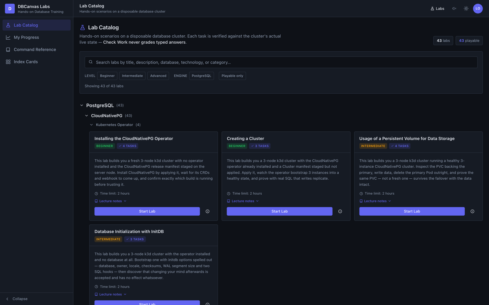
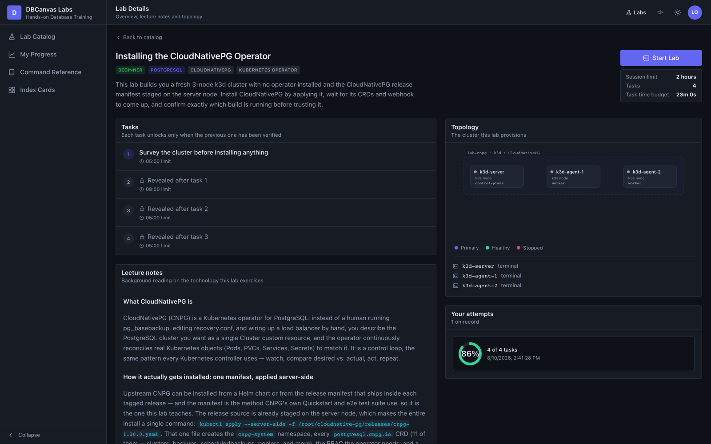
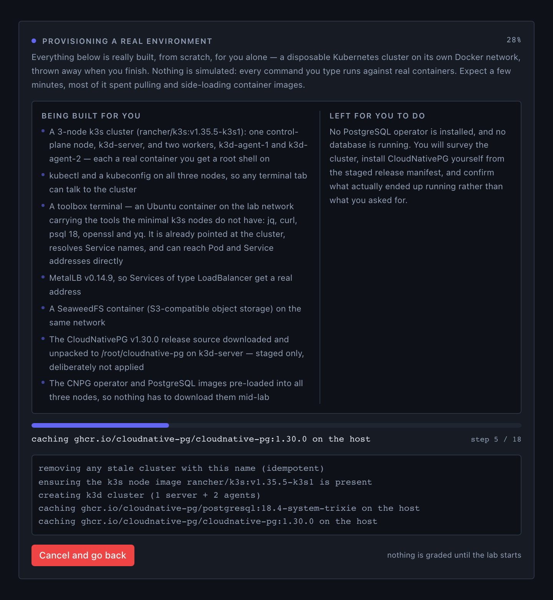
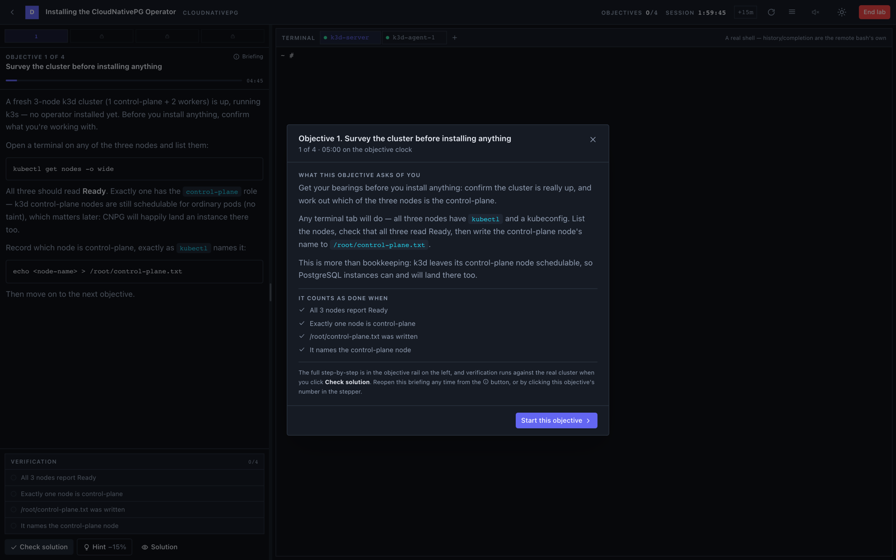
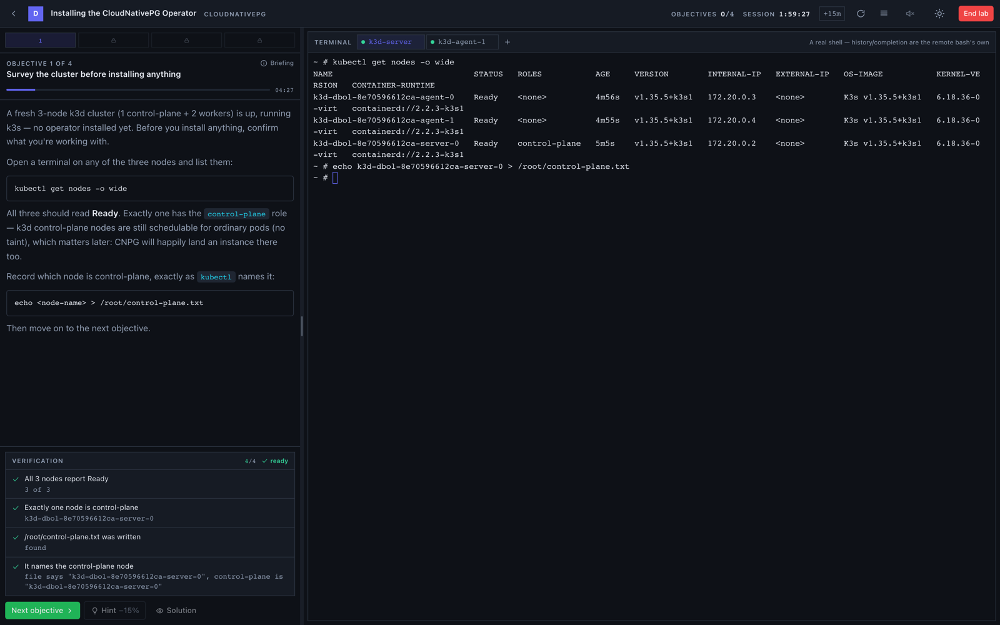
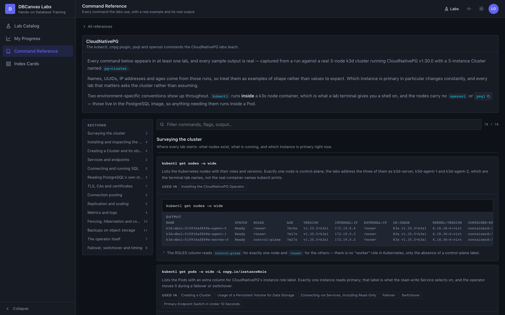
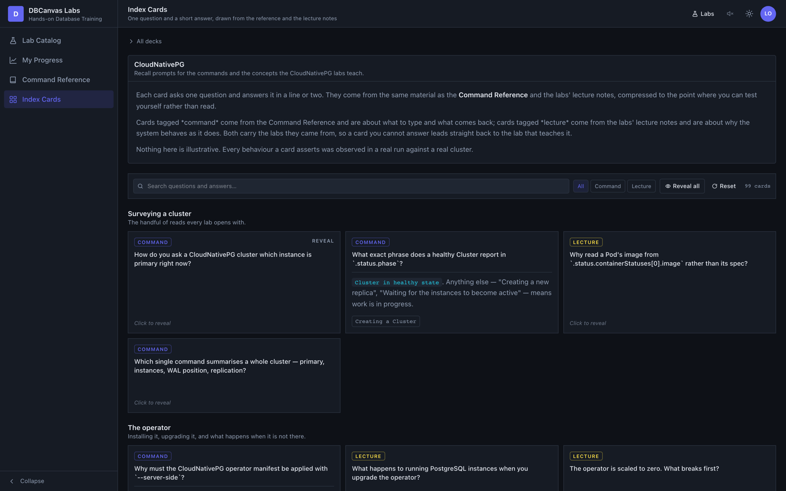

# DBCanvas Labs

A **hands-on lab platform for databases** — multi-task labs with a real terminal,
progressive task reveal, per-task time limits, and per-learner grading that runs actual
commands against real infrastructure rather than a simulation.

Every attempt provisions a disposable environment and is graded by reading what the
database and the software running it actually did — never the text a learner typed. The
platform is built to carry more than one technology: the lab catalog, the command
reference and the index card decks are each organised per technology, and adding one is a
new content module rather than a change to the pages that render it.

**Today that technology is CloudNativePG**, running PostgreSQL on a real 3-node k3d
cluster and graded with real `kubectl` and `psql`.

## What it looks like

Every screenshot below is a capture of the running app. The cluster in them was provisioned
by the app itself, and the command output is what those commands actually printed.

### The lab catalog

Every lab, grouped by technology and category, filterable by level, engine, and whether it
is playable.



### A lab, before you start it

Each lab's detail page: its objectives and their time limits, the topology it provisions,
the lecture notes behind it, and your own attempts on it.



### Provisioning a real environment

Starting a lab builds a disposable cluster from scratch. The brief spells out what is being
built and what is deliberately left undone for you, while the real provisioning log streams
underneath it.



### The objective briefing

Each objective opens with what it is asking of you and why it matters, and can be reopened
at any time from the Briefing button or from the stepper.



### The lab workspace

Instructions on the left, a real shell into a real k3s node on the right, verification
underneath. **Check solution** runs actual `kubectl` against the actual cluster — here all
four criteria pass, each showing the real value it read.



### Command Reference

The same material the labs teach, arranged by command instead of by scenario, each entry
with a real example and the real output it produced.



### Index Cards

One question and a short answer per card, written from the command reference and the labs'
lecture notes. Cards start face down and reveal on click.



## Running it

**Docker and Docker Compose are all you need.** Go, Node and `k3d` live inside the image.

```bash
make up        # build the image if needed, start the app → http://localhost:8090
make down      # stop the app (lab environments keep running)
make status    # the app container, plus any live lab environments
make logs      # follow the app's logs
make clean     # stop the app and tear down every lab environment it owns
make toolbox   # rebuild the lab toolbox image (`make up` builds it when it is missing)
```

`make up` copies `.env.example` to `.env` on first run; everything in it has a working
default. Plain `docker compose up --build -d` does the same thing.

One container, one process: the Go backend with the built React SPA embedded, serving the
UI and `/api` on the same port. It holds the host's Docker socket and drives the daemon to
create each lab environment as **sibling** containers (Docker-out-of-Docker) — which is why
`make down` leaves them running and the next start reclaims them.

> The app hands anyone who opens it a root shell inside a real Kubernetes node and drives
> the host's Docker daemon on their behalf, and its accounts screen is a browser-side mock
> with no real authentication. It publishes on `127.0.0.1` for that reason; only set
> `APP_HOST=0.0.0.0` on a machine you are willing to give away.

Sign in with one of the demo accounts on the login screen — **Learner**
(`learner` / `learner1`) or **Instructor** (`instructor` / `instructor`).

### Developing on it

The other loop runs the two processes natively, so frontend edits hot-reload instead of
rebuilding an image. This one *does* need Go 1.26+, Node, and `k3d` on `$PATH`:

```bash
make dev         # backend :8090 + Vite :5174, waits until both listen
make dev-down    # stop both
make dev-logs    # follow both logs
```

Open the Vite URL (`http://localhost:5174`) — it proxies `/api`, REST and the terminal
WebSocket, to the backend. A natively built binary serves a placeholder page at its own
port instead of the UI: the SPA is only embedded during the image build.

Prefer the compiled binary over `go run .`: `go run` execs the real server as a *child*
process, so stopping it leaves the backend listening and orphans the lab environments it
owns (this is what `make dev` does). Stopping the backend at all makes any provisioned
environment unreachable — the attempt registry is in memory — and the next start sweeps
those leftovers automatically.

## What it does

- **71-lab catalog** — all CloudNativePG on PostgreSQL today, all playable end to end
  against real infrastructure:
  - *Kubernetes Operator* (4) — installing the operator, creating a Cluster, persistent volumes,
    database initialization with initdb
  - *Service Connectivity* (4) — the read-write/read-only/read Services, client certificates,
    serving your own server certificate, PgBouncer
  - *Self-Healing* (8) — failover, switchover, endpoint-switch timing under 10s and 20s,
    degraded recovery, PVC deletion, corrupted PVC, fencing
  - *Operator* (10) — deployment anatomy, ConfigMap configuration, pod deletion and eviction,
    upgrade, high availability, hibernation, PostgreSQL configuration changes, rolling image
    updates, image catalogs
  - *Backup and Restore* (5) — volume snapshots, object storage, restore, point-in-time
    recovery, sequential vs parallel WAL restore
  - *Replication* (5) — replication slots, synchronous replication, scaling up and down,
    declarative logical replication, hot-standby-sensitive parameters
  - *Replica clusters* (3) — a separate Cluster streaming from another and detaching it,
    bootstrapping one from an object-store backup, and bootstrapping one from a volume snapshot
  - *Observability* (3) — metrics collection, PgBouncer metrics, JSON log format
  - *Pod Scheduling* (1) — taints and tolerations
- **Progressive reveal** — objective N+1 stays locked until N is verified.
- **Command Reference** — every command the labs teach, collected by command instead of by
  lab, each with a real example and the real output it produced. Nothing on that page is
  illustrative: the samples are captured from the same runs the labs were written from. One
  reference per technology, at `#/reference/<technology>`.
- **Index Cards** — one question and a short answer per card, written from the command
  reference and the labs' lecture notes, for testing recall rather than reading. Cards start
  face down and reveal on click, and each links back to the labs it came from. One deck per
  technology, at `#/cards/<technology>`.
- **Narration, off by default** — switched on from the speaker icon in the header, it reads
  the lab overview, the provisioning brief and every objective aloud, highlighting each word
  as it is spoken. It runs on the browser's own `speechSynthesis`: no dependency, nothing
  downloaded, works offline. Defaults to the machine's own voice — Samantha on macOS,
  Microsoft Zira on Windows — and the same header control turns it back off or switches to any other locally
  installed voice. Cloud voices are deliberately never used: they would send lab text to a
  vendor's servers and stop working offline.
- **Per-objective time limits** plus an overall session countdown with *Extend +15m*.
- **User management and grading** — learner progress, an instructor gradebook with a
  per-objective heat grid, and account approval / suspension / role changes.

## The workspace is a console, not a quiz

The lab player is built as an operations console that happens to set objectives:

- **A topology diagram on demand.** The Layout menu's "Open topology diagram" opens the
  real cluster's service graph without leaving the console — refreshed alongside each
  check, not on a background timer.
- **Manual, explicit grading.** A **Check Solution** button runs real checks against
  the real cluster on demand; only once it passes can you advance to the next objective.
  Hint and Solution disable themselves the moment an objective is already met.

## It's real, not simulated

Every attempt provisions an actual, disposable environment (`server/`, a Go backend
driving Docker directly): a real k3d cluster (1 server + 2 agents), real MetalLB, real
SeaweedFS, and the real CloudNativePG operator, installed the same way its own Quickstart
and e2e tests do — `kubectl apply --server-side` of the tagged release manifest, not a
Helm chart. The terminal is a real WebSocket into a real shell in the node's container.
Grading (`server/check.go`) runs the same `kubectl`/`psql` commands a human would and
reads their real output — never the text a learner typed.

This content and its real command transcripts, timings, and object names were originally
authored by mining a real K3D + CloudNativePG deploy through a sibling project's
(`../dbcanvas`, read-only, never modified) own running instance — see `LABORATORY.md` for
that pipeline and the roadmap of labs still to build.

## Grading

Checks read live cluster state and artifacts the learner produced on the nodes — never
the text they typed. Each check returns a granular checklist, so a failure names the
specific thing that is not true yet.

Scoring: solved within the limit **100%**, solved late **60%**, hint **−15%**,
solution revealed or timed out **0%**.

## Layout

```
src/
  labs/        catalog.json + the seventy-one lab definitions (content only — no grading)
  reference/   Command Reference content, one module per technology
  cards/       Index Card decks, one module per technology
  pages/       Catalog  LabDetail  LabPlayer  Reference  Cards  Progress  Gradebook  ManageUsers
  services/    Topology
  lab/         ObjectiveRail  Verification  ObjectiveBrief  Inspector
  speech/      narration on the browser's own speechSynthesis (no dependency, no network)
  terminal/    TerminalPane.jsx   (xterm.js bridged to a real WebSocket pty)
  lib/         attemptApi.js (backend REST client)  format.js  router.js
  components/  ui.jsx  Icons.jsx  Markdown.jsx  SplitPane.jsx  Charts.jsx
  auth/  store/  theme/
server/        real Go backend — Docker/k3d/CNPG/SeaweedFS orchestration + grading
  web/dist/    where the image build writes the SPA the binary embeds
toolbox/       the per-attempt tooling container (jq, curl, psql, openssl, yq) — `make toolbox`
docs/screenshots/   the captures used above, taken from a real run
Dockerfile          SPA build → Go build with it embedded → k3d binary → distroless
docker-compose.yml  the whole deployment: one service, one socket mount
```

Frontend built under the same constraints as its sibling project: React + Vite +
Tailwind v4 (CSS-first, no config file) + `@xterm/xterm`, and nothing else. Icons are
hand-written inline SVG; navigation is hash-based with no router. Backend: stdlib-only
Go (no Docker SDK, no Kubernetes client — `kubectl` itself, exec'd into a node), mirroring
patterns from `../dbcanvas`'s own `app/docker.go`/`k3d.go`.

## Notes and limits

- Accounts, attempts and per-learner scores live in `localStorage` — no real
  authentication or credential handling is involved. The *cluster* itself is real; the
  courseware/gradebook wrapper around it is still a local-only mock.
- Every attempt is a real, disposable environment — ending a lab tears it down. Because
  lab environments are siblings of the app container rather than children, stopping the
  app leaves them running but unreachable (the attempt registry is in memory); the next
  start sweeps them, `make status` lists them, and `make clean` removes them now.
- Content is derived from a read-only local project (`../dbcanvas`), which was not
  modified. Its own K3D + CloudNativePG + SeaweedFS deploy feature was driven through
  its running instance (never its source) to mine the real command transcripts, timings,
  and phase strings this app's labs are grounded in — see `LABORATORY.md`.

## License

**GNU General Public License v3.0 or later** — see [`LICENSE`](LICENSE).

Two things worth knowing beyond that:

- **The vendored CSI RBAC is Apache-2.0.** `server/csi.go` carries five ClusterRoles copied
  verbatim from the [kubernetes-csi](https://github.com/kubernetes-csi) sidecar repositories,
  used under the Apache License 2.0 and attributed in place. Apache-2.0 is one-way compatible
  with GPLv3, so the combined work is GPL while those lines keep their own licence.
  Everything else third-party — CloudNativePG, MetalLB, cert-manager, csi-driver-host-path,
  SeaweedFS, k3s and every container image — is fetched at runtime or pulled as an image
  rather than redistributed here.
- **Publishing the container image is distribution.** Under GPLv3 §6 the corresponding source
  has to be available to whoever receives the image. Publishing this repository alongside it
  satisfies that; worth remembering if the image is ever pushed somewhere the source is not.
